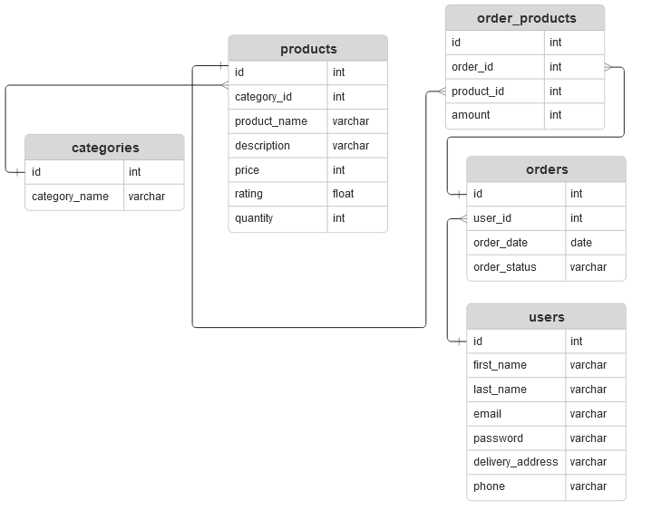

# MPP Furniture Shop
Тема проекту для лабораторних робіт: Онлайн магазин меблевий  
Автори: Мішуров Михайло КС33, Петренко Дмитро КС33

## API документація
| HTTP-метод                    | Шлях (URL)                                                                                                            | Дія                                                               |
|-------------------------------|-----------------------------------------------------------------------------------------------------------------------|-------------------------------------------------------------------|
| GET                           | /                                                                                                                     | Головна сторінка                                                  |
| GET, POST, DELETE             | /users/sign_in, /users/sign_out, /users/password/new | Авторизація, реєстрація, скидання пароля |
| GET | /categories/:id                           | Товари вказаної категорії                                            |
| GET | /products/:id                           | Інформація про товар                                           |
| GET | /orders                           | Кошик користувача                                           |
| GET | /profile                           | Профіль користувача                                           |
| POST | /orders/add_to_cart                          | Додати товар до кошика                                           |
| DELETE | /orders/:id                          | Видалити замовлення                                          |
| POST | /orders/update_quantity/:id                         | Змінити кількість товару у кошику                                          |
| POST | /orders/checkout                        | Оформити замовлення                                          |
## Діаграми


## Скрипти
- parsing.rb - зібрати дані про лікарні і створити data.csv  
- categories.rake - заповнити базу категоріями товарів  
- products.rake - заповнити базу товарами

## Запуск проекту
Встановлення гемів:
```
bundle install
```
Створення і заповнення бази даних:
```
rails db:create
rails db:migrate
rake categories
rake products
```
Запуск сервера:
```
rails s
```
Після цього додаток доступний за посиланням http://localhost:3000
